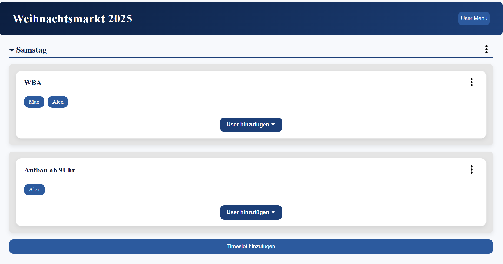

# 🚀 WM-Planner

WM-Planner is a web-based application for organizing and managing events that require multiple sales stands (e.g. festivals, markets, or large-scale gatherings).

It allows planners to efficiently assign stands, manage participants, and keep track of event logistics in a centralized system.

---

## ✨ Features

* 🗺️ Plan and organize sales stands
* 👥 Manage participants and assignments
* 📊 Structured overview of event logistics
* 🔐 Authentication-based access
* 🌐 Full-stack architecture (Angular + backend API)

---

## 🖼️ Preview



---

## 🛠️ Tech Stack

**Frontend**

* Angular
* TypeScript
* Firebase Hosting

**Backend**

* Spring Boot

**Database**

* Firebase Firestore

---

## 🔗 Live Demo

* Frontend: https://wm-planner.web.app/ *(authentication required)*
* Backend API: https://wm-planner-backend.onrender.com/

👉 Backend Repository: https://github.com/maxmp-q/wm-planner-backend

---

## ⚙️ Getting Started

### Prerequisites

* Node.js (LTS recommended)
* npm
* Angular CLI

---

### Installation

```bash
git clone https://github.com/maxmp-q/wm-planner.git
cd wm-planner
npm install
```

---

### Run locally

```bash
ng serve
```

Open:

```
http://localhost:4200
```

---

## 📁 Project Structure (simplified)

```
src/
 ├── app/
 │   ├── components/
 │   ├── services/
 │   ├── interfaces/
 │   └── store/
 ├── environments/
 └── styles/
```

---

## 🔐 Authentication & API

The application requires authentication to access protected features.
The frontend communicates with a separate backend service via REST APIs.

---

## 🚧 Future Improvements

* Improved UI/UX
* Role-based access control
* Advanced analytics for event planning
* Better mobile responsiveness

---

## 📄 License


MIT License


---

## 👤 Author

maxmp-q
GitHub: https://github.com/maxmp-q
